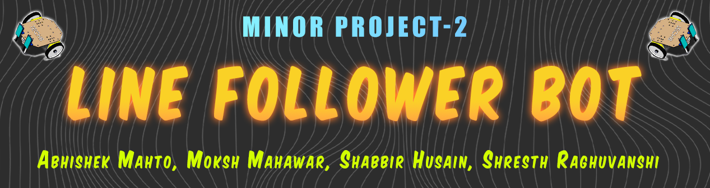
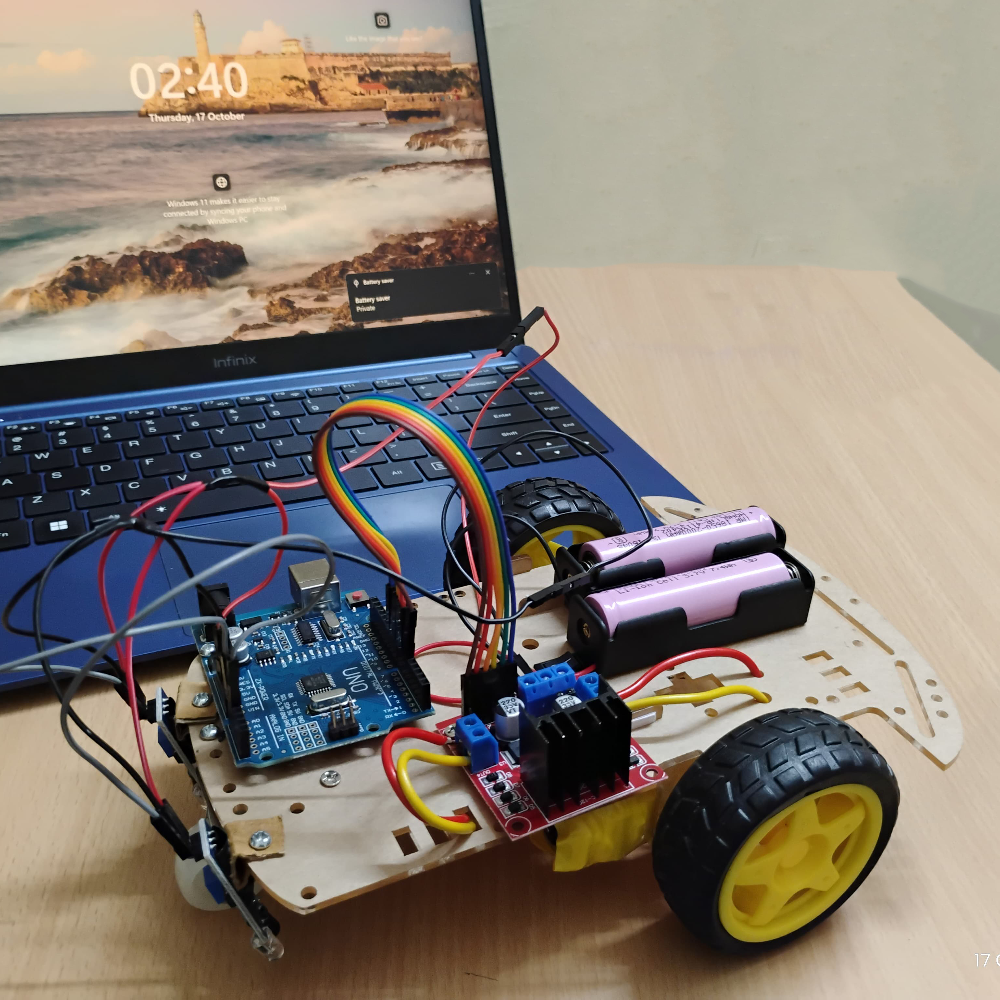
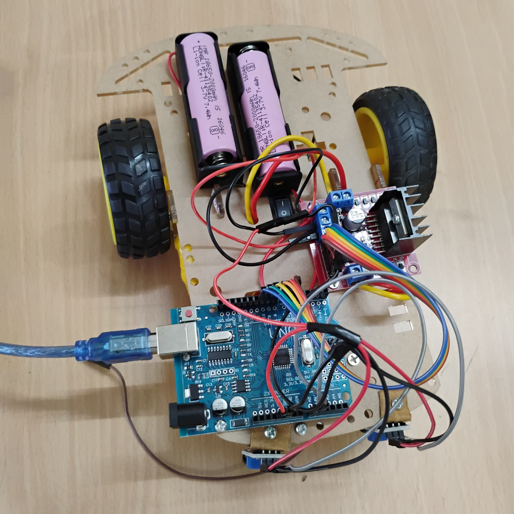

<p align="center">
  
</p>

<p align="center">
  
  &nbsp;&nbsp;
  
  &nbsp;&nbsp;
  
  &nbsp;&nbsp;
  
</p>

---

# 📌 Description

Line Follower Bot is an autonomous, sensor-based robot designed to detect and follow a defined path using infrared sensors and microcontroller logic. Built as a hardware-software integration project, it demonstrates real-time decision-making through embedded systems.

<p align="center">
  
</p>

---

# 🧰 Pre-Requisite

### 📦 Software
- Arduino IDE
- Familiarity with C++

### ⚙️ Hardware
- Arduino UNO R3 (ATmega328 microcontroller)
- USB Type-B Cable (printer style)
- TT Motors (Min: 2, Recommended: 4)
- Toy/Project Wheels
- Jumper Wires
- Motor Driver (Min: L298N, Recommended: L293D)
- Chassis (Cardboard works, R6 chassis recommended 😜)
- IR Sensors (Min: 2 single-channel, Recommended: 5/8-channel)
- Small trailing wheel or ball caster (optional)
- Battery (2× Li-Po 12V minimum — or a whole power station *just kidding* 💀)
- Battery Holder

---

# 🛠️ Installation

1. **Clone the repository**
   ```bash
   git clone https://github.com/TheCodedHuman/Minor-2_Line-Follower-Bot.git
   cd Minor-2_Line-Follower-Bot
   ```

2. **Open the Arduino IDE**
   - Open the `.ino` file from the `src/` folder.
   - Connect your Arduino board.

3. **Configure Board & Port**
   - Tools → Board → Arduino Uno
   - Tools → Port → Select correct COM

4. **Upload the code**
   - ✅ Verify
   - ⬆️ Upload

5. **Wiring Setup**
   - IR Sensors → Pins `2`, `3`
   - Motor Driver:
     - Left Motor → Pins `10`, `11`
     - Right Motor → Pins `8`, `9`
     - Enable Pins → `5`, `6`
   - Power via USB or external supply

---

# 🔌 Circuit Diagram

<p align="center">
  
</p>

---

# 🖥️ Usage

<p align="center">
  
</p>

---

# 🧱 Working Model Images

<p align="center">
  
</p>

<p align="center">
  
</p>

---

# 👥 Team Members

- Abhishek Mahto  
- Moksh Mahawar  
- Shabbir Husain  
- Shresth Raghuvanshi

---

# 🎬 Behind the Scenes ;)

⚙️ Fun Fact: This bot may look simple, but getting those IR sensors to *consistently* detect a black line without throwing a tantrum was half the battle. Loose wires, uneven IR thresholds, tape width, and unplanned robot dance routines were all part of the journey 😅

<!-- Placeholder: Add GitHub usernames and commit badge in future -->
